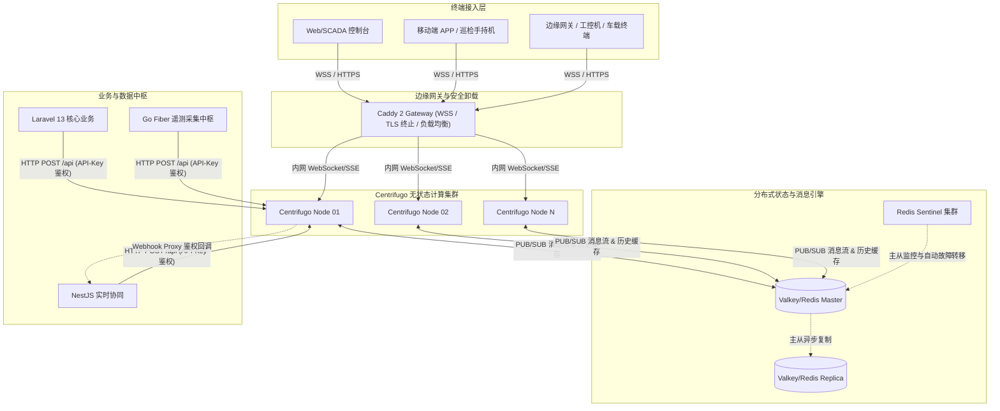

# Centrifugo v6 工业级产品架构与生产实践指南

本文档面向工业物联网（IIoT）、智能制造、金融高频交易、跨地域物流追踪及企业级协作等**关键任务（Mission-Critical）工业产品场景**，提供 Centrifugo v6 的全链路架构设计、高可用部署、内核与服务调优、命名空间安全隔离以及可观测性体系。

---

## 1. 工业级应用场景全景

```mermaid
mindmap
  root((Centrifugo<br/>工业生产场景))
    智能制造与 IIoT
      数控机床/PLC 遥测数据实时流
      AGV 搬运车动态轨迹与状态告警
      "数字孪生 (Digital Twin) 毫米级位姿同步"
      SCADA 工控看板多终端广播
    智慧物流与车联网
      冷链车温湿度与 GNSS 连续轨迹上报
      电子围栏越界毫秒级警报下发
      仓储自动化高频调度指令广播
    金融高频与交易风控
      Level-2 实时行情与撮合成交回报
      账户资产变动与大额风控强平通知
      分布式审计日志与心跳探针
    企业级实时协作
      "工业 CAD 协同评审与光标状态 (Presence)"
      "跨组织工单流转与即时通讯 (IM)"
      多租户数据权限硬隔离
```

---

## 2. 工业级高可用架构拓扑

在工业生产环境中，Centrifugo 采用**无状态集群 + 分布式内存引擎（Valkey/Redis）+ 边缘网关（Caddy/Nginx）**的经典解耦拓扑：



### 工业级核心特性保障：

1. **绝对无状态节点**：Centrifugo 各节点间无直接通信，全部通过底层 Valkey/Redis 的 PUB/SUB 进行集群广播，支持根据连接数与 CPU 负载实现**秒级无感水平弹性扩缩容**。
2. **断线零丢失与消息恢复 (Offset-based Recovery)**：利用 Valkey 内存 Stream / List 缓存频道消息历史，客户端重连时自动携带 `epoch` 与 `offset`，Centrifugo 自动增量补发未读消息，消除弱网抖动对工业采集的影响。
3. **零信任网络 (Zero-Trust Security)**：长连接通过 HMAC-SHA256 JWT 建立，所有频道订阅均经过细粒度权限校验，绝对禁止匿名客户端直接向集群发布数据（`allow_publish_for_subscriber: false`）。

---

## 3. 工业级 `config.yaml` 核心配置矩阵

```yaml
# =============================================================================
# Centrifugo v6 工业级生产配置矩阵
# =============================================================================

# 1. 传输层协议与连接池加固
websocket:
  use_write_buffer_pool: true
  message_size_limit: 65536     # 64KB: 严格限制单包上行大小，防爆破与内存耗尽

# 启用多协议降级矩阵，保障现场复杂工业防火墙环境下的 100% 连通率
uni_websocket:
  enabled: true
http_stream:
  enabled: true
sse:
  enabled: true
uni_sse:
  enabled: true                 # 允许边缘工控机使用原生 EventSource 免 SDK 直连

# 2. 引擎连接池与稳定性调优
engine:
  type: redis
  redis:
    connect_timeout: "1s"
    io_timeout: "4s"

# 3. 客户端资源保护与心跳探针
client:
  # 工业环境严禁匿名连接
  allow_anonymous_connect_without_token: false
  
  # 毫秒级精准保活探针，快速侦测掉线设备
  ping_interval: 20s
  pong_timeout: 6s
  
  # 节点级资源配额限制
  connection_limit: 50000       # 单节点连接数软上限
  user_connection_limit: 20     # 单设备/单用户最大并发多开限制
  queue_max_size: 1048576       # 1MB 单客户端发送队列缓冲区，超时立即熔断
  stale_close_delay: "10s"

# 4. 可观测性与健康检查
admin:
  enabled: true
  handler_prefix: "/admin"
health:
  enabled: true
prometheus:
  enabled: true                 # 暴露 /metrics 供 Prometheus 监控抓取

log:
  level: info

# 5. 工业级场景命名空间隔离 (Namespace Matrix)
channel:
  history_meta_ttl: "720h"      # 历史元数据在 Redis 中保留 30 天
  
  namespaces:
    # ----------------------------------------------------
    # A. 遥测数据流 (Telemetry)：高频设备数据上报、SCADA 状态大屏
    # 特点：高吞吐、极小历史、不记录在线成员（降低内存）、开启快速恢复
    # ----------------------------------------------------
    - name: telemetry
      presence: false
      join_leave: false
      history_size: 20
      history_ttl: "120s"
      allow_recovery: true
      force_recovery: true
      allow_publish_for_subscriber: false
      allow_subscribe_for_client: true

    # ----------------------------------------------------
    # B. 工业告警与风控 (Alarms)：超温/过载/越界毫秒级报警
    # 特点：中吞吐、深度历史持久、强制恢复、绝对可靠
    # ----------------------------------------------------
    - name: alarms
      presence: false
      join_leave: false
      history_size: 500
      history_ttl: "3600s"
      allow_recovery: true
      force_recovery: true
      allow_publish_for_subscriber: false
      allow_subscribe_for_client: true

    # ----------------------------------------------------
    # C. 设备反控与指令下发 (Commands)：点对点下发控制指令
    # 特点：私有加密、必须持后端签发的订阅 Token 才能监听
    # ----------------------------------------------------
    - name: commands
      presence: false
      join_leave: false
      history_size: 50
      history_ttl: "600s"
      allow_recovery: true
      force_recovery: true
      allow_publish_for_subscriber: false
      allow_subscribe_for_client: false

    # ----------------------------------------------------
    # D. 协同感知 (Presence/Collab)：多人在线协同评审、数字孪生光标
    # 特点：记录谁在线、上下线广播通知
    # ----------------------------------------------------
    - name: collab
      presence: true
      join_leave: true
      history_size: 50
      history_ttl: "300s"
      allow_recovery: true
      force_recovery: true
      allow_publish_for_subscriber: false
      allow_subscribe_for_client: true
```

---

## 4. 宿主机与操作系统内核调优规范

高并发长连接（10万+ 并发）依赖 Linux 宿主机内核网络协议栈优化。在生产服务器 `/etc/sysctl.conf` 中追加以下调优项：

```ini
# 最大文件打开数与 Socket 句柄上限
fs.file-max = 2097152

# 最大 Socket 监听队列长度 (防 SYN Flood 与突发连接堆积)
net.core.somaxconn = 65535
net.ipv4.tcp_max_syn_backlog = 65535

# 本地出向端口范围 (避免短连接调用耗尽端口)
net.ipv4.ip_local_port_range = 1024 65535

# TCP 内存与读写缓冲区自动调优 (4KB 最小, 87KB 默认, 16MB 最大)
net.ipv4.tcp_rmem = 4096 87380 16777216
net.ipv4.tcp_wmem = 4096 65536 16777216

# 快速回收处于 TIME_WAIT 状态的 TCP 连接
net.ipv4.tcp_fin_timeout = 15
net.ipv4.tcp_tw_reuse = 1

# 开启 TCP Keepalive 工业探针参数 (防中间防火墙静默切断连接)
net.ipv4.tcp_keepalive_time = 300
net.ipv4.tcp_keepalive_intvl = 15
net.ipv4.tcp_keepalive_probes = 5
```

执行生效命令：

```bash
sysctl -p
```

---

## 5. 工业级客户端健壮性规范 (抗弱网与自愈)

工业现场（如车间 Wi-Fi 漫游、4G/5G 隧道穿梭）经常面临网络闪断与高延迟。客户端接入必须实现**指数退避算法（Exponential Backoff + Jitter）**与**双向状态同步**：

```typescript
import { Centrifuge } from 'centrifuge';

// 1. 初始化工业级长连接客户端
const centrifuge = new Centrifuge('wss://push.factory.com/connection/websocket', {
  // 异步获取/刷新 Connection Token
  getToken: async () => {
    const res = await fetch('/api/v1/auth/centrifugo-token', { credentials: 'include' });
    if (!res.ok) throw new Error('Token refresh failed');
    const data = await res.json();
    return data.token;
  },
  // 指数退避重连算法配置
  minReconnectDelay: 500,    // 初始重连间隔: 500ms
  maxReconnectDelay: 20000,  // 最大重连间隔: 20s
  maxServerPingDelay: 10000, // 超过 10 秒未收到服务器 ping 则判定网络失效
});

// 2. 全生命周期状态监听
centrifuge.on('connected', (ctx) => {
  console.info(`[Centrifugo] Connected. ClientID: ${ctx.client}, Transport: ${ctx.transport}`);
});

centrifuge.on('disconnected', (ctx) => {
  console.warn(`[Centrifugo] Disconnected: code=${ctx.code}, reason=${ctx.reason}`);
});

// 3. 订阅工业遥测频道 (启用自动恢复)
const telemetrySub = centrifuge.newSubscription('telemetry:device_cnc_08', {
  // 必须开启 recover 保证数据连续
  positioned: true,
  recoverable: true,
  joinLeave: false,
});

telemetrySub.on('publication', (ctx) => {
  const { data, offset } = ctx;
  console.debug(`[Telemetry] Offset: ${offset}`, data);
  // 更新前端仪表盘或 3D 孪生姿态
});

// 监听断线自动恢复成功
telemetrySub.on('subscribing', (ctx) => {
  console.info(`[Telemetry] Re-subscribing: ${ctx.reason}`);
});

telemetrySub.on('subscribed', (ctx) => {
  console.info(`[Telemetry] Subscribed! Was recovered: ${ctx.wasRecovering}`);
});

telemetrySub.subscribe();
centrifuge.connect();
```

---

## 6. 全链路监控与告警指标 (Prometheus & Grafana)

Centrifugo 原生暴露标准 Prometheus 指标接口（`/metrics`）。在生产环境中必须对以下关键指标配置告警规则：

| 监控指标 (Metric) | 关注维度 | 告警阈值建议 | 含义与排查方向 |
| :--- | :--- | :--- | :--- |
| `centrifugo_client_active_connections` | 在线连接数 | 波动 > 30% / 5min | 突发断连说明网络波动或网关异常 |
| `centrifugo_node_client_num_msg_dropped` | 丢弃消息计数 | `> 0` | 客户端缓冲区积压溢出，需调大 `queue_max_size` |
| `centrifugo_engine_redis_pub_sub_lag_seconds` | Redis 订阅延迟 | `> 0.05s (50ms)` | Redis CPU 瓶颈或带宽受限 |
| `centrifugo_http_api_duration_seconds` | HTTP API 耗时 | P99 `> 0.1s` | 业务发布性能退化，需检查内网连接 |
| `centrifugo_client_recovered_success_total` | 历史消息补发恢复率 | 成功率 `< 90%` | 频道 `history_size` 设得太小，重连来不及补齐 |

---

## 7. 生产灾备与应急操作手册

### A. Redis 故障自动切换演练

- **现象**：Valkey/Redis Master 宕机。
- **自愈机制**：Redis Sentinel 自动将 Replica 提升为 Master，Centrifugo 会在 `io_timeout` 超时后自动重连新 Master，期间客户端连接保持建立，消息在 Master 切换完成后自动恢复广播。

### B. 节点无感滚动升级

1. 部署新版本 Centrifugo 容器实例并加入内网负载均衡池。
2. 对老版本实例发送 `SIGTERM` 信号，Centrifugo 触发优雅停机（Graceful Shutdown），主动向连接的客户端发送重连指引并关闭连接。
3. 客户端接收到关闭信号后在毫秒内无感重连到新版本节点。
