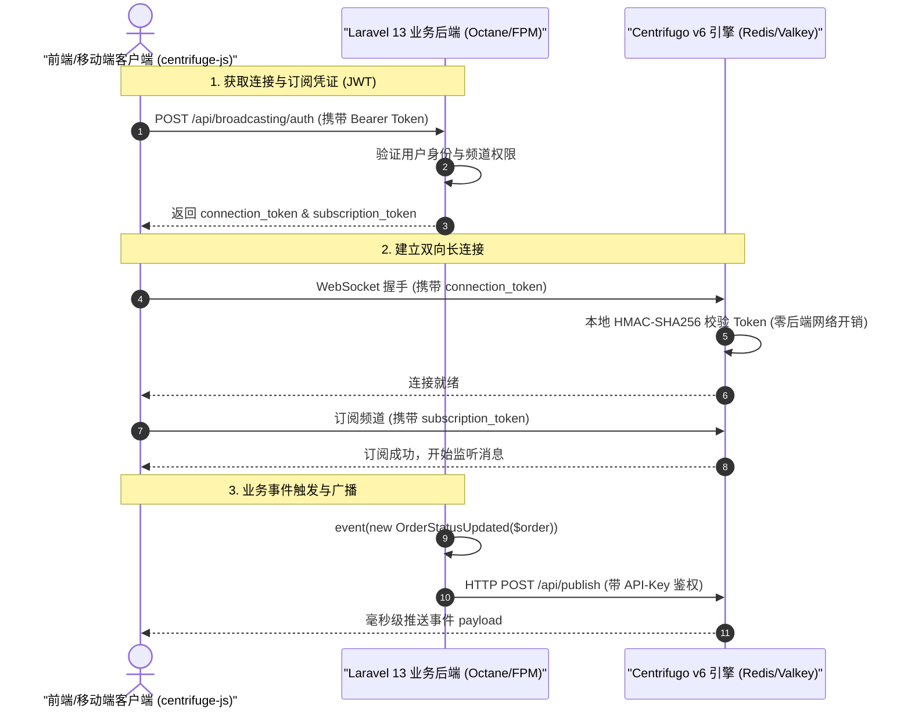

# Laravel 13 与 Centrifugo v6 最佳实践集成指南

本文档提供 **Laravel 13 (PHP 8.2+)** 接入 **Centrifugo v6** 的企业级最佳实践，涵盖原生广播驱动扩展（`Illuminate\Contracts\Broadcasting\Broadcaster`）、JWT 鉴权凭证生成、HTTP API 消息下发客户端以及 Centrifugo Webhook/Proxy 代理回调处理。

---

## 1. 架构设计与交互流程



---

## 2. 环境配置与配置包

### A. 环境变量配置 (`.env`)

```ini
# Centrifugo 服务地址 (Docker 内网通信或宿主机代理)
CENTRIFUGO_API_URL=http://centrifugo:8000/api
CENTRIFUGO_API_KEY=dev-centrifugo-http-api-key-change-me
CENTRIFUGO_SECRET=dev-centrifugo-token-hmac-secret-key-change-me

# 广播驱动切换为自定义 centrifugo
BROADCAST_CONNECTION=centrifugo
```

### B. 配置文件 (`config/centrifugo.php`)

```php
<?php

declare(strict_types=1);

return [
    'api_url' => env('CENTRIFUGO_API_URL', 'http://centrifugo:8000/api'),
    'api_key' => env('CENTRIFUGO_API_KEY', ''),
    'secret' => env('CENTRIFUGO_SECRET', ''),
  
    // 连接 Token 默认过期时长 (秒)
    'token_ttl' => (int) env('CENTRIFUGO_TOKEN_TTL', 86400),
  
    // HTTP API 超时控制 (秒)
    'timeout' => 3.0,
];
```

---

## 3. 核心实现代码

### A. Centrifugo 客户端服务 (`app/Services/CentrifugoService.php`)

```php
<?php

declare(strict_types=1);

namespace App\Services;

use Firebase\JWT\JWT;
use Illuminate\Http\Client\Factory as HttpFactory;
use Illuminate\Http\Client\Response;
use RuntimeException;

class CentrifugoService
{
    public function __construct(
        protected HttpFactory $http,
        protected string $apiUrl,
        protected string $apiKey,
        protected string $secret,
        protected int $tokenTtl = 86400,
    ) {}

    /**
     * 生成客户端连接 Token (Connection JWT)
     */
    public function generateConnectionToken(string $userId, array $info = [], ?int $exp = null): string
    {
        $payload = [
            'sub'  => $userId,
            'iat'  => time(),
            'exp'  => $exp ?? (time() + $this->tokenTtl),
            'info' => $info,
        ];

        return JWT::encode($payload, $this->secret, 'HS256');
    }

    /**
     * 生成频道私有订阅 Token (Subscription JWT)
     */
    public function generateSubscriptionToken(string $userId, string $channel, array $info = [], ?int $exp = null): string
    {
        $payload = [
            'sub'     => $userId,
            'channel' => $channel,
            'iat'     => time(),
            'exp'     => $exp ?? (time() + $this->tokenTtl),
            'info'    => $info,
        ];

        return JWT::encode($payload, $this->secret, 'HS256');
    }

    /**
     * 向指定频道推送消息 (Publish)
     */
    public function publish(string $channel, array $data, bool $skipHistory = false): array
    {
        return $this->sendRequest('publish', [
            'channel'      => $channel,
            'data'         => $data,
            'skip_history' => $skipHistory,
        ]);
    }

    /**
     * 批量多频道广播推送 (Broadcast)
     */
    public function broadcast(array $channels, array $data, bool $skipHistory = false): array
    {
        return $this->sendRequest('broadcast', [
            'channels'     => $channels,
            'data'         => $data,
            'skip_history' => $skipHistory,
        ]);
    }

    /**
     * 获取在线成员列表 (Presence)
     */
    public function presence(string $channel): array
    {
        return $this->sendRequest('presence', ['channel' => $channel]);
    }

    /**
     * 查询历史消息 (History)
     */
    public function history(string $channel, int $limit = 50): array
    {
        return $this->sendRequest('history', [
            'channel' => $channel,
            'limit'   => $limit,
        ]);
    }

    /**
     * 强制断开指定用户所有连接 (Disconnect)
     */
    public function disconnect(string $userId): array
    {
        return $this->sendRequest('disconnect', ['user' => $userId]);
    }

    /**
     * 底层 HTTP 请求封装 (复用 HTTP 客户端连接池)
     */
    protected function sendRequest(string $method, array $params = []): array
    {
        /** @var Response $response */
        $response = $this->http
            ->timeout(3.0)
            ->withHeaders([
                'X-API-Key'    => $this->apiKey,
                'Content-Type' => 'application/json',
            ])
            ->post($this->apiUrl, [
                'method' => $method,
                'params' => $params,
            ]);

        if (!$response->successful()) {
            throw new RuntimeException("Centrifugo API error: [{$response->status()}] {$response->body()}");
        }

        $result = $response->json();
        if (isset($result['error'])) {
            throw new RuntimeException("Centrifugo Error [{$result['error']['code']}]: {$result['error']['message']}");
        }

        return $result['result'] ?? [];
    }
}
```

---

### B. 自定义 Laravel 13 广播驱动 (`app/Broadcasting/CentrifugoBroadcaster.php`)

通过实现 `Illuminate\Contracts\Broadcasting\Broadcaster` 接口，使 Laravel 原生的 `broadcast(new Event())` 和 `Broadcast::routes()` 自动适配 Centrifugo：

```php
<?php

declare(strict_types=1);

namespace App\Broadcasting;

use App\Services\CentrifugoService;
use Illuminate\Broadcasting\Broadcasters\Broadcaster;
use Illuminate\Broadcasting\BroadcastException;
use Symfony\Component\HttpKernel\Exception\AccessDeniedHttpException;

class CentrifugoBroadcaster extends Broadcaster
{
    public function __construct(
        protected CentrifugoService $centrifugo
    ) {}

    /**
     * 鉴权频道访问 (用于私有/受限频道订阅 Token 签发)
     */
    public function auth($request)
    {
        $channelName = $this->normalizeChannelName($request->channel_name);
        $user = $request->user();

        if (!$user) {
            throw new AccessDeniedHttpException('Unauthenticated.');
        }

        // 调用 channels.php 中定义的权限规则
        try {
            $result = $this->verifyUserCanAccessChannel($request, $channelName);
        } catch (\Exception $e) {
            throw new AccessDeniedHttpException($e->getMessage(), $e);
        }

        if (!$result) {
            throw new AccessDeniedHttpException('Unauthorized channel access.');
        }

        $userId = (string) $user->getAuthIdentifier();
        $userInfo = is_array($result) ? $result : ['name' => $user->name ?? 'User'];

        // 签发 Centrifugo 专用的订阅 Token
        $token = $this->centrifugo->generateSubscriptionToken($userId, $channelName, $userInfo);

        return response()->json([
            'token' => $token,
        ]);
    }

    /**
     * 验证订阅结果返回
     */
    public function validAuthenticationResponse($request, $result)
    {
        return $result;
    }

    /**
     * 广播事件下发到 Centrifugo
     */
    public function broadcast(array $channels, $event, array $payload = [])
    {
        $normalizedChannels = array_map([$this, 'normalizeChannelName'], $channels);

        try {
            $this->centrifugo->broadcast($normalizedChannels, [
                'event' => $event,
                'data'  => $payload,
            ]);
        } catch (\Throwable $e) {
            throw new BroadcastException("Failed to broadcast event to Centrifugo: " . $e->getMessage(), (int) $e->getCode(), $e);
        }
    }

    /**
     * 规范化频道名称 (支持 private- / presence- 前缀映射到命名空间)
     */
    protected function normalizeChannelName(string $channel): string
    {
        // 自动将 Laravel 标准的 private-orders.1 转换为 Centrifugo 命名空间 private:orders.1
        if (str_starts_with($channel, 'private-')) {
            return 'private:' . substr($channel, 8);
        }
        if (str_starts_with($channel, 'presence-')) {
            return 'public:' . substr($channel, 9);
        }

        return $channel;
    }
}
```

---

### C. 注册广播服务提供者 (`app/Providers/CentrifugoBroadcastServiceProvider.php`)

```php
<?php

declare(strict_types=1);

namespace App\Providers;

use App\Broadcasting\CentrifugoBroadcaster;
use App\Services\CentrifugoService;
use Illuminate\Broadcasting\BroadcastManager;
use Illuminate\Contracts\Foundation\Application;
use Illuminate\Support\ServiceProvider;

class CentrifugoBroadcastServiceProvider extends ServiceProvider
{
    public function register(): void
    {
        $this->app->singleton(CentrifugoService::class, function (Application $app) {
            $config = $app['config']->get('centrifugo');

            return new CentrifugoService(
                http: $app->make('http.client.factory'),
                apiUrl: $config['api_url'],
                apiKey: $config['api_key'],
                secret: $config['secret'],
                tokenTtl: $config['token_ttl']
            );
        });
    }

    public function boot(BroadcastManager $broadcastManager): void
    {
        $broadcastManager->extend('centrifugo', function (Application $app) {
            return new CentrifugoBroadcaster(
                $app->make(CentrifugoService::class)
            );
        });
    }
}
```

在 `bootstrap/providers.php` 中引入该 Provider 即可。

---

### D. 事件广播定义实战 (`app/Events/OrderStatusUpdated.php`)

```php
<?php

declare(strict_types=1);

namespace App\Events;

use App\Models\Order;
use Illuminate\Broadcasting\Channel;
use Illuminate\Broadcasting\InteractsWithSockets;
use Illuminate\Broadcasting\PrivateChannel;
use Illuminate\Contracts\Broadcasting\ShouldBroadcast;
use Illuminate\Foundation\Events\Dispatchable;
use Illuminate\Queue\SerializesModels;

class OrderStatusUpdated implements ShouldBroadcast
{
    use Dispatchable, InteractsWithSockets, SerializesModels;

    public function __construct(
        public Order $order
    ) {}

    /**
     * 指定广播的目标频道
     */
    public function broadcastOn(): array
    {
        // 映射到 Centrifugo 的 private:orders.{id}
        return [
            new PrivateChannel('orders.' . $this->order->id),
        ];
    }

    /**
     * 自定义事件名称
     */
    public function broadcastAs(): string
    {
        return 'order.status_updated';
    }

    /**
     * 广播 Payload 载荷
     */
    public function broadcastWith(): array
    {
        return [
            'order_id'   => $this->order->id,
            'status'     => $this->order->status,
            'updated_at' => $this->order->updated_at->toIso8601String(),
        ];
    }
}
```

在控制器或服务层直接触发：

```php
event(new OrderStatusUpdated($order));
```

---

## 4. 前端客户端接入 (JavaScript / TypeScript)

使用官方 `centrifuge-js` 客户端：

```typescript
import { Centrifuge } from 'centrifuge';

const userId = '1001';

// 1. 初始化 Centrifuge 实例
const centrifuge = new Centrifuge('ws://localhost:8000/connection/websocket', {
    // 异步获取 Connection Token
    getToken: async () => {
        const res = await fetch('/api/broadcasting/connection-token', {
            headers: { 'Authorization': `Bearer ${userToken}` }
        });
        const data = await res.json();
        return data.token;
    }
});

// 2. 监听连接事件
centrifuge.on('connected', (ctx) => {
    console.log('Centrifugo Connected:', ctx);
});

// 3. 订阅私有频道 (自动通过 getToken 拿 Subscription Token)
const sub = centrifuge.newSubscription('private:orders.123', {
    getToken: async () => {
        const res = await fetch('/api/broadcasting/subscription-token', {
            method: 'POST',
            headers: {
                'Content-Type': 'application/json',
                'Authorization': `Bearer ${userToken}`
            },
            body: JSON.stringify({ channel: 'private:orders.123' })
        });
        const data = await res.json();
        return data.token;
    }
});

sub.on('publication', (ctx) => {
    console.log('Received Message:', ctx.data);
});

sub.subscribe();
centrifuge.connect();
```
