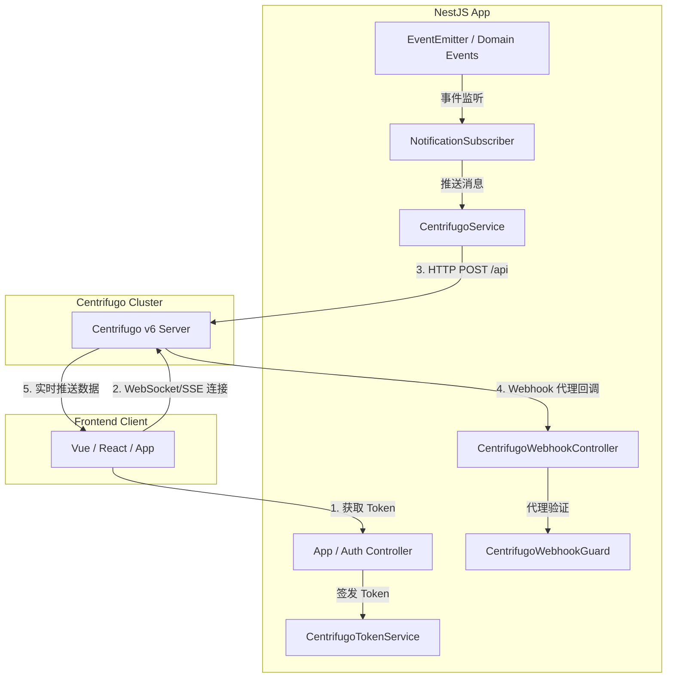

# NestJS 与 Centrifugo v6 最佳实践集成指南

本文档提供 **NestJS (TypeScript)** 接入 **Centrifugo v6** 的企业级最佳实践，涵盖动态模块设计（`CentrifugoModule`）、JWT 鉴权凭证签发、HTTP API 封装、基于 `@nestjs/event-emitter` 的异步事件推送机制以及 Centrifugo 代理回调安全守卫（`CentrifugoWebhookGuard`）。

---

## 1. 架构设计与模块分层



---

## 2. 模块定义与配置注入

### A. 环境变量与配置定义 (`src/config/centrifugo.config.ts`)

```typescript
import { registerAs } from '@nestjs/config';

export const centrifugoConfig = registerAs('centrifugo', () => ({
  apiUrl: process.env.CENTRIFUGO_API_URL || 'http://centrifugo:8000/api',
  apiKey: process.env.CENTRIFUGO_API_KEY || '',
  secret: process.env.CENTRIFUGO_TOKEN_HMAC_SECRET_KEY || '',
  tokenTtl: parseInt(process.env.CENTRIFUGO_TOKEN_TTL || '86400', 10),
}));
```

### B. 模块接口定义 (`src/centrifugo/centrifugo.interfaces.ts`)

```typescript
export interface CentrifugoModuleOptions {
  apiUrl: string;
  apiKey: string;
  secret: string;
  tokenTtl?: number;
}

export interface CentrifugoApiRequest<T = any> {
  method: string;
  params: T;
}

export interface CentrifugoApiResponse<T = any> {
  result?: T;
  error?: {
    code: number;
    message: string;
  };
}
```

---

## 3. 核心服务实现

### A. Token 签发服务 (`src/centrifugo/centrifugo-token.service.ts`)

负责为客户端签发 Connection Token 和 Channel Subscription Token：

```typescript
import { Injectable, Inject } from '@nestjs/common';
import * as jwt from 'jsonwebtoken';
import { CentrifugoModuleOptions } from './centrifugo.interfaces';

@Injectable()
export class CentrifugoTokenService {
  constructor(
    @Inject('CENTRIFUGO_OPTIONS')
    private readonly options: CentrifugoModuleOptions,
  ) {}

  /**
   * 生成长连接凭证 (Connection Token)
   */
  generateConnectionToken(userId: string, info: Record<string, any> = {}, ttl?: number): string {
    const expireIn = ttl || this.options.tokenTtl || 86400;
    const payload = {
      sub: userId,
      info,
      exp: Math.floor(Date.now() / 1000) + expireIn,
      iat: Math.floor(Date.now() / 1000),
    };

    return jwt.sign(payload, this.options.secret, { algorithm: 'HS256' });
  }

  /**
   * 生成私有频道订阅凭证 (Subscription Token)
   */
  generateSubscriptionToken(
    userId: string,
    channel: string,
    info: Record<string, any> = {},
    ttl?: number,
  ): string {
    const expireIn = ttl || this.options.tokenTtl || 86400;
    const payload = {
      sub: userId,
      channel,
      info,
      exp: Math.floor(Date.now() / 1000) + expireIn,
      iat: Math.floor(Date.now() / 1000),
    };

    return jwt.sign(payload, this.options.secret, { algorithm: 'HS256' });
  }
}
```

---

### B. HTTP API 调用服务 (`src/centrifugo/centrifugo.service.ts`)

```typescript
import { Injectable, Inject, Logger, HttpException, HttpStatus } from '@nestjs/common';
import axios, { AxiosInstance } from 'axios';
import { CentrifugoModuleOptions, CentrifugoApiResponse } from './centrifugo.interfaces';

@Injectable()
export class CentrifugoService {
  private readonly logger = new Logger(CentrifugoService.name);
  private readonly axiosClient: AxiosInstance;

  constructor(
    @Inject('CENTRIFUGO_OPTIONS')
    private readonly options: CentrifugoModuleOptions,
  ) {
    this.axiosClient = axios.create({
      baseURL: this.options.apiUrl,
      timeout: 4000,
      headers: {
        'X-API-Key': this.options.apiKey,
        'Content-Type': 'application/json',
      },
    });
  }

  /**
   * 向单个频道发布消息
   */
  async publish<T = any>(channel: string, data: T, skipHistory = false): Promise<any> {
    return this.sendRequest('publish', {
      channel,
      data,
      skip_history: skipHistory,
    });
  }

  /**
   * 批量频道广播
   */
  async broadcast<T = any>(channels: string[], data: T, skipHistory = false): Promise<any> {
    return this.sendRequest('broadcast', {
      channels,
      data,
      skip_history: skipHistory,
    });
  }

  /**
   * 获取在线成员
   */
  async presence(channel: string): Promise<any> {
    return this.sendRequest('presence', { channel });
  }

  /**
   * 查询历史记录
   */
  async history(channel: string, limit = 50): Promise<any> {
    return this.sendRequest('history', { channel, limit });
  }

  /**
   * 强制注销/断开用户连接
   */
  async disconnect(userId: string): Promise<any> {
    return this.sendRequest('disconnect', { user: userId });
  }

  /**
   * 底层请求发送
   */
  private async sendRequest(method: string, params: Record<string, any>): Promise<any> {
    try {
      const response = await this.axiosClient.post<CentrifugoApiResponse>('', {
        method,
        params,
      });

      if (response.data.error) {
        this.logger.error(`Centrifugo Error [${response.data.error.code}]: ${response.data.error.message}`);
        throw new HttpException(response.data.error.message, HttpStatus.BAD_GATEWAY);
      }

      return response.data.result;
    } catch (err) {
      this.logger.error(`Failed to invoke Centrifugo API [${method}]: ${err.message}`);
      throw err;
    }
  }
}
```

---

### C. 动态模块装配 (`src/centrifugo/centrifugo.module.ts`)

```typescript
import { Module, DynamicModule, Global } from '@nestjs/common';
import { CentrifugoService } from './centrifugo.service';
import { CentrifugoTokenService } from './centrifugo-token.service';
import { CentrifugoModuleOptions } from './centrifugo.interfaces';

@Global()
@Module({})
export class CentrifugoModule {
  static forRoot(options: CentrifugoModuleOptions): DynamicModule {
    return {
      module: CentrifugoModule,
      providers: [
        {
          provide: 'CENTRIFUGO_OPTIONS',
          useValue: options,
        },
        CentrifugoService,
        CentrifugoTokenService,
      ],
      exports: [CentrifugoService, CentrifugoTokenService],
    };
  }

  static forRootAsync(asyncOptions: {
    useFactory: (...args: any[]) => Promise<CentrifugoModuleOptions> | CentrifugoModuleOptions;
    inject?: any[];
  }): DynamicModule {
    return {
      module: CentrifugoModule,
      providers: [
        {
          provide: 'CENTRIFUGO_OPTIONS',
          useFactory: asyncOptions.useFactory,
          inject: asyncOptions.inject || [],
        },
        CentrifugoService,
        CentrifugoTokenService,
      ],
      exports: [CentrifugoService, CentrifugoTokenService],
    };
  }
}
```

在 `app.module.ts` 中注册：

```typescript
@Module({
  imports: [
    ConfigModule.forRoot({ isGlobal: true, load: [centrifugoConfig] }),
    CentrifugoModule.forRootAsync({
      inject: [ConfigService],
      useFactory: (config: ConfigService) => config.get('centrifugo'),
    }),
  ],
})
export class AppModule {}
```

---

## 4. 业务应用与事件驱动订阅

### 领域事件推送示例 (`src/notifications/notification.listener.ts`)

```typescript
import { Injectable } from '@nestjs/common';
import { OnEvent } from '@nestjs/event-emitter';
import { CentrifugoService } from '../centrifugo/centrifugo.service';

export class OrderCreatedEvent {
  constructor(
    public readonly orderId: string,
    public readonly userId: string,
    public readonly totalAmount: number,
  ) {}
}

@Injectable()
export class NotificationListener {
  constructor(private readonly centrifugo: CentrifugoService) {}

  @OnEvent('order.created', { async: true })
  async handleOrderCreated(event: OrderCreatedEvent) {
    // 推送到用户个人私有命名空间频道: user:1001
    await this.centrifugo.publish(`user:${event.userId}`, {
      type: 'order_notification',
      title: '订单创建成功',
      payload: {
        orderId: event.orderId,
        amount: event.totalAmount,
        createdAt: new Date().toISOString(),
      },
    });
  }
}
```

---

## 5. Webhook 与 Proxy 鉴权守卫 (`CentrifugoWebhookGuard`)

当在 Centrifugo 中配置 Proxy 时，Centrifugo 会通过 HTTP POST 回调 NestJS：

```typescript
import { CanActivate, ExecutionContext, Injectable, UnauthorizedException } from '@nestjs/common';
import { ConfigService } from '@nestjs/config';
import * as crypto from 'crypto';

@Injectable()
export class CentrifugoWebhookGuard implements CanActivate {
  constructor(private readonly configService: ConfigService) {}

  canActivate(context: ExecutionContext): boolean {
    const request = context.switchToHttp().getRequest();
    const signature = request.headers['x-centrifugo-signature'];
    const secret = this.configService.get<string>('centrifugo.secret');

    if (!signature || !secret) {
      throw new UnauthorizedException('Missing signature or secret');
    }

    // HMAC-SHA256 签名计算校验
    const bodyStr = JSON.stringify(request.body);
    const expected = crypto.createHmac('sha256', secret).update(bodyStr).digest('hex');

    if (signature !== expected) {
      throw new UnauthorizedException('Invalid Centrifugo signature');
    }

    return true;
  }
}
```
